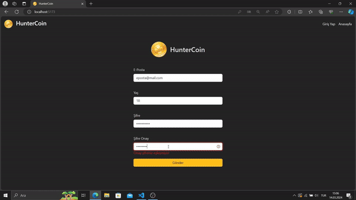

# React Coin Tracker

React Coin Tracker, kullanıcıların kripto para birimlerini takip etmelerini sağlayan basit bir web uygulamasıdır. Bu uygulama, React.js ve react-router-dom gibi modern web teknolojilerini kullanır.

## Özellikler

- Kullanıcılar giriş yapabilir
- Anasayfada kullanıcıların kripto para birimlerini görebileceği bir ana kontrol paneli bulunur.
- Kullanıcılar belirli bir kripto para biriminin detaylarını görmek için detay sayfasına yönlendirilir.

## Kullanılan Teknolojiler

- React.js
- react-router-dom
- Axios (HTTP istekleri için)
- Bootstrap (Kullanıcı arayüzü için)
- Chart.js (Grafikler oluşturmak için)
- Formik (Form yönetimi için)
- Millify (Sayıları okunabilir formata dönüştürmek için)
- React Icons (İkonlar için)
- Yup (Şema doğrulama için)
- JavaScript (ES6+)

## Nasıl Kullanılır

1. Ana sayfada, kullanıcılar giriş yapabilir veya kayıt olabilir.
2. Giriş yaptıktan sonra, kullanıcılar ana kontrol panelinde kripto para birimlerini görebilir.
3. Kullanıcılar, belirli bir kripto para biriminin detaylarını görmek için listeden bir öğeyi seçebilir.

## Ekran Görüntüsü

